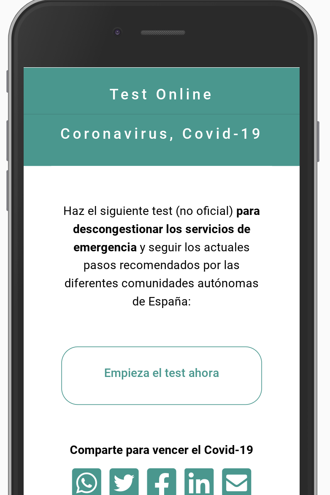

# Coronavirus Covid-19 Online Test

## IN ENGLISH: Instructions to adapt this online test

Find here the base source code of https://yometesteoencasa.com

Steps to follow if you want to adapt it to your country:

1. Copy the index.html file as well as the CSS css to the root of the server.

2. Check that your new hosted webapp has the same experience as the one you can find on this test page: https://yometesteoencasa.com/github/

3. Finally, ammend the contend and/or the code to align with the official recommendations in you country.

---

Frameworks/libraries used:
- Bootstrap
- JQuery
- FontAwesome

## EN ESPAÑOL: Instrucciones para adaptar este test online

Encuentra aquí el código fuente base de https://yometesteoencasa.com

Pasos a seguir si quieres adaptarlo a tu país:

1. Copia el archivo index.html así como la carpea CSS en la raíz (root) de tu servidor.

2. Una vez realizado el paso anterior, comprueba que tienes la misma experiencia que la que puedes encontrar en esta página de prueba: https://yometesteoencasa.com/github/

3. Finalmente, adapta el contenido y/o el código para alinearte satisfactoriamente con las recomendaciones oficiales del país donde habites.

---

Librerías/frameworks usados:
- Bootstrap
- JQuery
- FontAwesome
